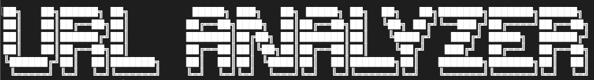
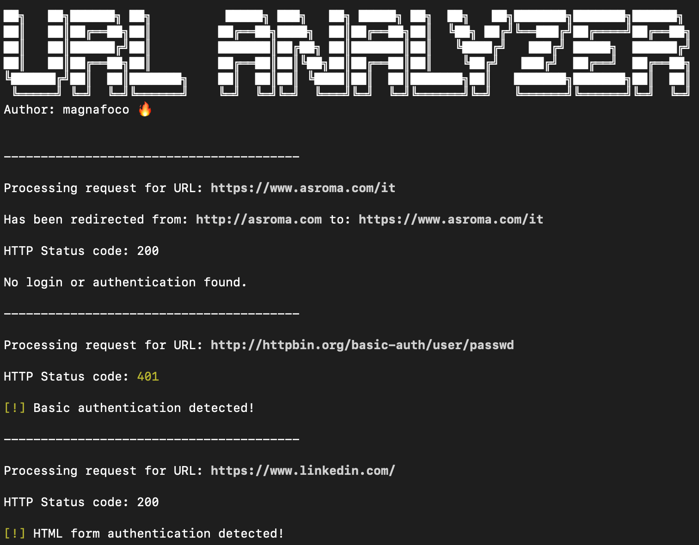
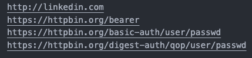

<h1 align="center">
  <a href="https://github.com/magnafoco/urlanalyzer">
    <!-- Please provide path to your logo here -->
    
  </a>
</h1>

<div align="center">
  URLanalyzer
  <br />
  <a href="#about"><strong>Explore the screenshots »</strong></a>
  <br />
  <br />
  <a href="https://github.com/magnafoco/urlanalyzer/issues/new?assignees=&labels=bug&template=01_BUG_REPORT.md&title=bug%3A+">Report a Bug</a>
  ·
  <a href="https://github.com/magnafoco/urlanalyzer/issues/new?assignees=&labels=enhancement&template=02_FEATURE_REQUEST.md&title=feat%3A+">Request a Feature</a>
  ·
  <a href="https://github.com/magnafoco/urlanalyzer/issues/new?assignees=&labels=question&template=04_SUPPORT_QUESTION.md&title=support%3A+">Ask a Question</a>
  <br>
  <br>
  <a href="https://www.buymeacoffee.com/magnafoco" target="_blank"></a>
</div>
<br>

<details open="open">
<summary>Table of Contents</summary>

- [About](#about)
  - [Built With](#built-with)
- [Getting Started](#getting-started)
  - [Prerequisites](#prerequisites)
  - [Installation](#installation)
- [Usage](#usage)
- [Roadmap](#roadmap)
- [Support](#support)
- [Project assistance](#project-assistance)
- [Contributing](#contributing)
- [Authors \& contributors](#authors--contributors)
- [Security](#security)
- [License](#license)

</details>

---

## About

**URLanalyzer** is a script written in Python 3 intended to help Cyber Security experts during the reconnaissance and enumeration phases of a Website.<br>
It can do several things:

- Check the HTTP status code;
- Check the redirection from HTTP to HTTPS;
- Check if and what authentication method is implemented.

The project is a Work In Progress and something may not work as expected, stay tuned, there will be new features. 

<details>
<summary>Screenshots</summary>
<br>

|                               How works                               |
| :-------------------------------------------------------------------: |
|  |

</details>

### Built With

- [Python 3](https://www.python.org)

## Getting Started

### Prerequisites

First things you need is Python 3 follow this official guide to install it: https://wiki.python.org/moin/BeginnersGuide/Download.<br>
The recommended method to install dependencies and use **URLanalyzer** is by using Pip.

### Installation

Clone the repo:

```Bash
git clone https://github.com/magnafoco/urlanalyzer
```

Install requirements using Pip:

```Bash
cd urlanalyzer && pip install -r requirements.txt
```

## Usage

Make sure you are into the project folder **URLanalyzer** or go into with `cd urlanalyzer`.

```Bash
python3 urlanalyzer.py --input <filename.txt> --auth
```


-----

This is an example of the format that `<filename.txt>` should have:



## Roadmap

See the [open issues](https://github.com/magnafoco/urlanalyzer/issues) for a list of proposed features (and known issues).

- [Top Feature Requests](https://github.com/magnafoco/urlanalyzer/issues?q=label%3Aenhancement+is%3Aopen+sort%3Areactions-%2B1-desc) (Add your votes using the 👍 reaction)
- [Top Bugs](https://github.com/magnafoco/urlanalyzer/issues?q=is%3Aissue+is%3Aopen+label%3Abug+sort%3Areactions-%2B1-desc) (Add your votes using the 👍 reaction)
- [Newest Bugs](https://github.com/magnafoco/urlanalyzer/issues?q=is%3Aopen+is%3Aissue+label%3Abug)

## Support

Contact me [here](mailto:lists.sitcom_0x@icloud.com).

Reach out to the maintainer at one of the following places:

- [GitHub issues](https://github.com/magnafoco/urlanalyzer/issues/new?assignees=&labels=question&template=04_SUPPORT_QUESTION.md&title=support%3A+)
- Contact options listed on [this GitHub profile](https://github.com/magnafoco)

## Project assistance

If you want to say **thank you** or/and support active development of URLanalyzer:

- Add a [GitHub Star](https://github.com/magnafoco/urlanalyzer) to the project.
- Write interesting articles about the project on [Dev.to](https://dev.to/), [Medium](https://medium.com/) or your personal blog.

## Contributing

First off, thanks for taking the time to contribute! Contributions are what make the open-source community such an amazing place to learn, inspire, and create. Any contributions you make will benefit everybody else and are **greatly appreciated**.


Please read [our contribution guidelines](docs/CONTRIBUTING.md), and thank you for being involved!

## Authors & contributors

The original setup of this repository is by [magnafoco](https://github.com/magnafoco).

For a full list of all authors and contributors, see [the contributors page](https://github.com/magnafoco/urlanalyzer/contributors).

## Security

URLanalyzer follows good practices of security, but 100% security cannot be assured.
URLanalyzer is provided **"as is"** without any **warranty**. Use at your own risk.

_For more information and to report security issues, please refer to our [security documentation](docs/SECURITY.md)._

## License

This project is licensed under the **MIT license**.

See [LICENSE](LICENSE) for more information.
